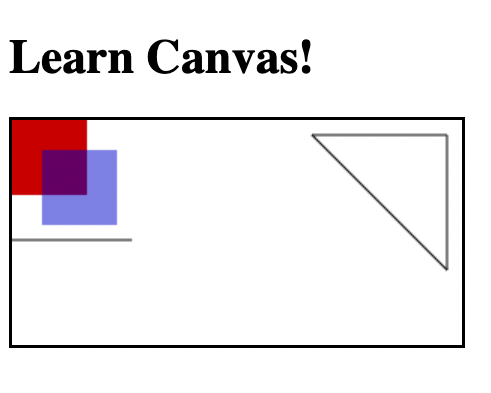

# learn-canvas

## What is canvas?
`<canvas>` is an html element that can be used to draw graphics on your website! With canvas, you can draw shapes, animations, or even photos!

The `<canvas>` element is a container for the graphics that you draw using javascript. Think of it as a clear canvas and which a painter paints on!


Canvas supports several methods for drawing graphics, such as paths, boxes, circles, text, and images.

Here is an example of our empty canvas on the screen! (A black border was added to make the canvas visible)
```html
<canvas id="canvas" style="border:2px solid black"></canvas>
```


The canvas element can also take width and height properties inside the element tag
```html
<canvas id="canvas" width="150" height="150"></canvas>
```
This will start us off with a 150x150px canvas. **Note**: if you do not specify a height/width, the canvas will default to 300px wide by 150px high.

You could style the canvas using CSS, however images inside of the canvas will render to the aspect ratio set by the canvas element *not* the CSS. (You may get distored images). The size of the canvas can also be set using javascript!

## How to use Canvas
### HTML Tag
First we need to add a canvas html element to our `index.html`.
```html
<canvas id="canvas" style="border:2px solid black"></canvas>
```
We can add this anywhere to our `body`. Lets add it right after our `<h1>` tag!

```html
<!DOCTYPE html>
<html lang="en">
<head>
    <meta charset="UTF-8">
    <meta http-equiv="X-UA-Compatible" content="IE=edge">
    <meta name="viewport" content="width=device-width, initial-scale=1.0">
    <title>Learn Canvas</title>
    <link rel="stylesheet" href="styles.css">
</head>
<body>
    <h1>Learn Canvas!</h1>
    <canvas id="canvas" style="border:2px solid black"></canvas>
    <script src="./script.js"></script>
</body>
</html>
```

Anything placed inside of the `<canvas>` element will act as our alternate in case the brower doesn't support canvas.

```html
<canvas id="canvas">
    This will show if the browser doesn't support canvas
</canvas>
```

### The rendering context
The `<canvas>` element creates a fixed-size surface for us to draw on. In order to create or manipulate content on the canvas, we need to access the canvas rendering context. There are different types of rendering (2D, 3D), but we will focus on 2D rendering in this lesson. 

In order to access the 2D rendering context, we need to first grab the canvas DOM element in our `script.js` file.
```js
    const canvas = document.querySelector('#canvas');
```

*Note*: You can now resize the canvas using JavaScript if needed.
```js
    canvas.width = 300;
    canvas.height = 150;
```

Now that we have access to the DOM node, we can access built in methods of the `<canvas>` element. We want to grab the rendering context and set it to a variable (ctx is used by convention). We will pass in `2d` as the only parameter to ensure we grab the 2d rendering context.
```js
    const canvas = document.querySelector('#canvas');
    const ctx = canvas.getContext('2d');
```

### Things are looking very square
Lets now create our first image on the canvas! We will start by creating a simple square. We need to tell canvas two things in order to do this properly.
1. Tell canvas what type of shape, how big it should be, and *where* to render it.
2. What color the shape should be.

Lets tackle the first part! In order to create a square, we need to tell the `ctx` to `fillRect(x, y, width, height)`. This is used to a rectangular shape. The `fillRect()` takes in 4 arguements:
1. x: The x-axis coordinate of the rectangle's starting point (a value of 0 would start the square at the left side of the canvas)
2. y: The y-axis coordinate of the rectangle's starting point (a value of 0 would start the square at the top of the canvas)
3. width: The width of the rectangle
4. height: The height of the rectangle


This is how we can make our first square start all the way to the top left and be 50px x 50px
```js
    ctx.fillRect(0, 0, 50, 50);
```

Now we just need to set the square's color! To affect the styles of a canvas drawing, we can use `fillStyle`! (**Note**: `fillStyle` *must* come before the `fillRect` in our code)
```js
    ctx.fillStyle = 'rgb(200, 0, 0)';
    ctx.fillRect(0, 0, 50, 50);
```

Check out your `index.html`! It should look something like this.


Now lets create a second square of the same size that overlaps the first one! We can create a square with a style of `rgba(0, 0, 200, 0.5)` and place it 20px away from the top, and 20px away from the left.

<details>
    <summary>Solution</summary>
    
```js
    ctx.fillStyle = 'rgba(0, 0, 200, 0.5)';
    ctx.fillRect(20, 20, 50, 50);
```
</details>

## Drawing Lines

In order to draw any kind of line or path using canvas, we need to begin by calling the `beginPath()` method on the `ctx`.
```js
    ctx.beginPath();
```

We can specify the color of the line by setting the `strokeStyle`.
```js
    ctx.strokeStyle = 'black';
```

Imagine that we are instructing someone to draw a line for us on a piece of paper. The first thing we might tell them, is where to start the line. We have to tell canvas where to *move* the pen to.
```js
    // First parameter is the x position
    // Second parameter is the y position
    ctx.moveTo(0, 80);
```
This is the point where canvas will start to draw from. Now, we can tell canvas to make a line!
```js
    // First parameter is the x position
    // Second parameter is the y position
    ctx.lineTo(80, 80);
```
The final step to actually draw the path, is to call the `stroke` method on `ctx`. All together it should look like this.
```js
    ctx.beginPath();
    ctx.strokeStyle = 'black';
    ctx.moveTo(0, 80);
    ctx.lineTo(80, 80);
    ctx.stroke();
```

**Note**: Only one `ctx.stroke()` method is required per canvas. You can draw as many lines as your would like, and just call `ctx.stroke()` at the bottom of the file.

We should now have a line under our square!


## Drawing Triangles
Using what we know about lines, we can draw the outline of a triangle. Once the outline is complete, we can call the `ctx.fill()` method to color it in!

Lets add a triangle to our current canvas by first beginning a new path, and moving to the point on our canvas that we want to draw from (lets use a starting point of 290, 10)
```js
    ctx.beginPath();
    ctx.moveTo(290, 10);
```
Lets draw our lines for the triangle
```js
    // Right side of triangle
    ctx.lineTo(290, 100);
    // Left side of triangle
    ctx.lineTo(200, 10);
    // Top of triangle
    ctx.lineTo(290, 10);
```
We should now have an outlined triangle appearing in our canvas!



Now lets fill change the fill style, and fill it in!
```js
    ctx.fillStyle = 'green';
    ctx.fill();
```
The complete code for the triangle should look like this
```js
    ctx.beginPath();
    ctx.moveTo(290, 10);
    ctx.lineTo(290, 100);
    ctx.lineTo(200, 10);
    ctx.lineTo(290, 10);
    ctx.fillStyle = 'green';
    ctx.fill();
```

## Drawing Arcs
Lets now learn how to use the `ctx.arc` method so we can learn how to draw arcs and cirlces

The arc method takes in 6 parameters:
1. x: starting x position
2. y: starting y position
3. radius: the radius of the arc
4. startAngle: the starting angle (in radians)
5. endAngle: the ending angle (in radians)
6. counterClockwise: boolean (false for clockwise)
    


The arc function takes in angles as *radians*. One radian is the resulting angle if we take the radius and wrap it around the circle. More on radians [here](https://www.mathsisfun.com/geometry/radians.html)
<br>


To draw a half circle, we would need end at 3.14 radians (π). For a full circle, we would end at 6.28 (2π). In js, we can use `Math.PI` for π. So to draw a half circle, our code would look something like this.
```js
    // moving our pen to the start of the arc perimeter
    ctx.moveTo(200,100);
    ctx.arc(150, 100, 50, 0, -Math.PI, true);
    ctx.stroke();
```
## Code that smiles back
Lets utilize what he have learned to draw a smiley face! Open up the `part-two/script.js` follow along with the instructions. Open up [link for part-two live server](http://127.0.0.1:5500/part-two/index.html) if using live server!


<br>
<br>
Wait! What is up with the lines connecting my shapes??? We didn't tell canvas to pick up and move the pen! Lets use the `moveTo()` method before we create the arc! (must move to the starting point of the arcs perimeter, *not* the center of the arc)

<details>
    <summary>Solution</summary>
    
```js
// begin path
ctx.beginPath();

// Outer circle
// use 150, 75 as starting point
// use radius of 50
ctx.arc(150, 75, 50, 0, Math.PI * 2, true);

// Mouth (clockwise)
// use radius of 35
ctx.moveTo(185, 75);
ctx.arc(150, 75, 35, 0, Math.PI, false);

// Left eye
// use 135, 65 as starting point
// use radius of 5
ctx.moveTo(140, 65);
ctx.arc(135, 65, 5, 0, Math.PI * 2, true);

// Right eye
// use 165, 65 as starting point
// use radius of 5
ctx.moveTo(170, 65);
ctx.arc(165, 65, 5, 0, Math.PI * 2, true);

// call stroke method
ctx.stroke();
```
    
</details>

## Cube Crusher
Lets demonstrate how powerful `<canvas>` can be! Open up the `part-three/challenge.js` and follow along with the instructions. Open up [link for part-three live server](http://127.0.0.1:5500/part-three/index.html) if using live server! **Do not edit anything inside of the `/js` or `/maps` folders**

**Inside of `challenge.js`**

1. Lets grab the canvas html element with an id `game_display` and save it to a variable called `canvas`.
<details>
    <summary>Solution</summary>
    
```js
const canvas = document.querySelector('#game_display');
```
    
</details>
2. Now get the canvas rendering context and set it to a variable called `ctx`.
<details>
    <summary>Solution</summary>
    
```js
const ctx = canvas.getContext('2d');
```
    
</details>
3. Set the canvas width to 900 and the height to 490.
<details>
    <summary>Solution</summary>
    
```js
canvas.width = 900;
canvas.height = 490;
```
    
</details>
4. Create a function called `draw` that takes in `ctx` as a parameter.
<details>
    <summary>Solution</summary>
    
```js
function draw(ctx) {

}
```
    
</details>
5. Inside of the `draw` function, lets use canvas to render a square! It can have any starting position, any size, and any color you like!
<details>
    <summary>Solution</summary>
    
```js
function draw(ctx) {
    ctx.fillStyle = 'red';
    ctx.fillRect(20, 20, 50, 50);
}
```
    
</details>
6. Now that we have our square on the screen, wouldn't it be cool if we could move it? Lets do it! Replace the x and y position parameters in `fillRect()` with the variables `xPosition` and `yPosition`.
<details>
    <summary>Solution</summary>
    
```js
function draw(ctx) {
    ctx.fillStyle = 'red';
    ctx.fillRect(xPosition, yPosition, 50, 50);
}
```
    
</details>
7. Lets work with another canvas to create a background for our square to move through! But first, lets resize our square to ensure that it fits in the background. Set its width and height to be 20x20.
<details>
    <summary>Solution</summary>
    
```js
function draw(ctx) {
    ctx.fillStyle = 'red';
    ctx.fillRect(xPosition, yPosition, 20, 20);
}
```
    
</details>
8. Now grab the `<canvas>` with an id `game_background` and save it to a variable called `backgroundCanvas`.
<details>
    <summary>Solution</summary>
    
```js
    const backgroundCanvas = document.querySelector('#game_background');
```
    
</details>
9. Get the canvas rendering context and save it to a variable called `backgroundctx`.
<details>
    <summary>Solution</summary>
    
```js
    const backgroundctx = backgroundCanvas.getContext('2d');
```
    
</details>
10. Finally, set the `backgroundCanvas` width to 900 and the height to 480.
<details>
    <summary>Solution</summary>
    <br>
    
```js
    backgroundCanvas.width = 900;
    backgroundCanvas.height = 480;
```
    
</details>
